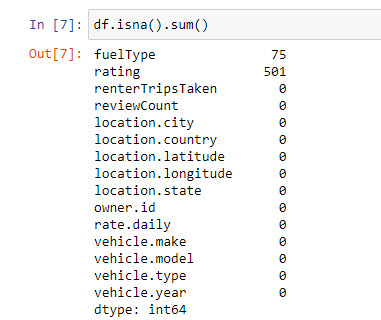
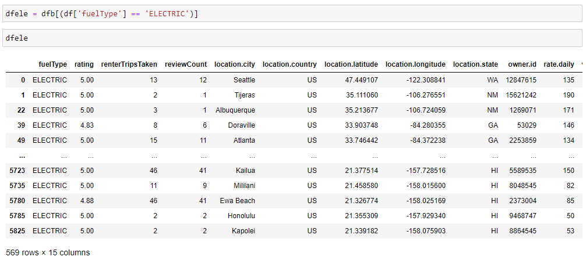
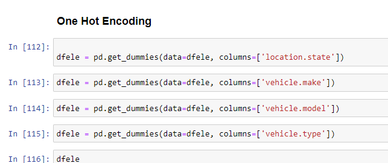
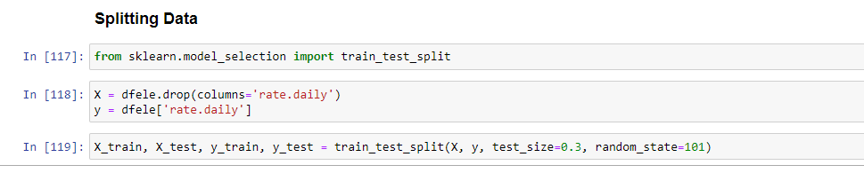
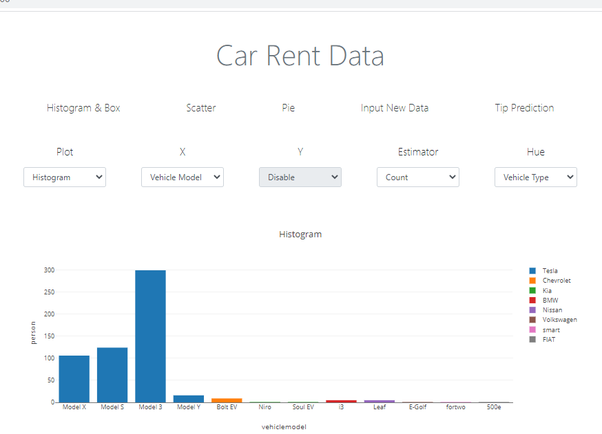
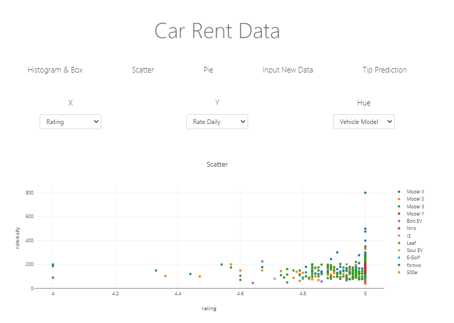
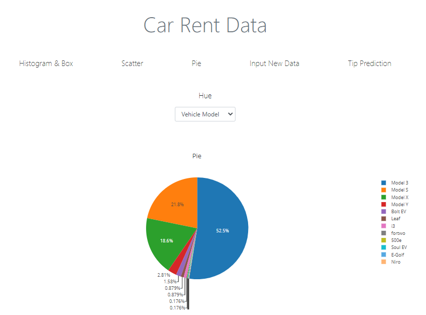
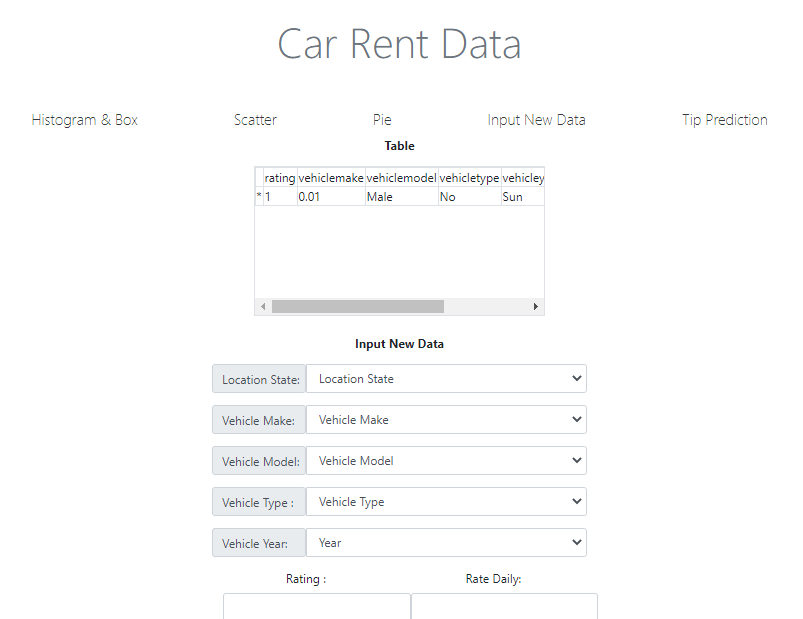
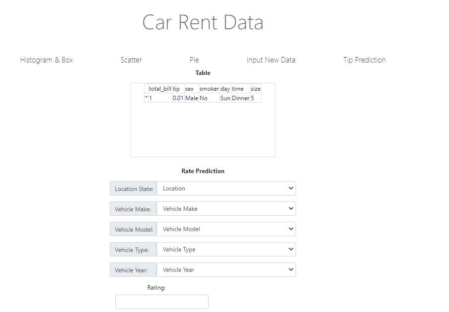
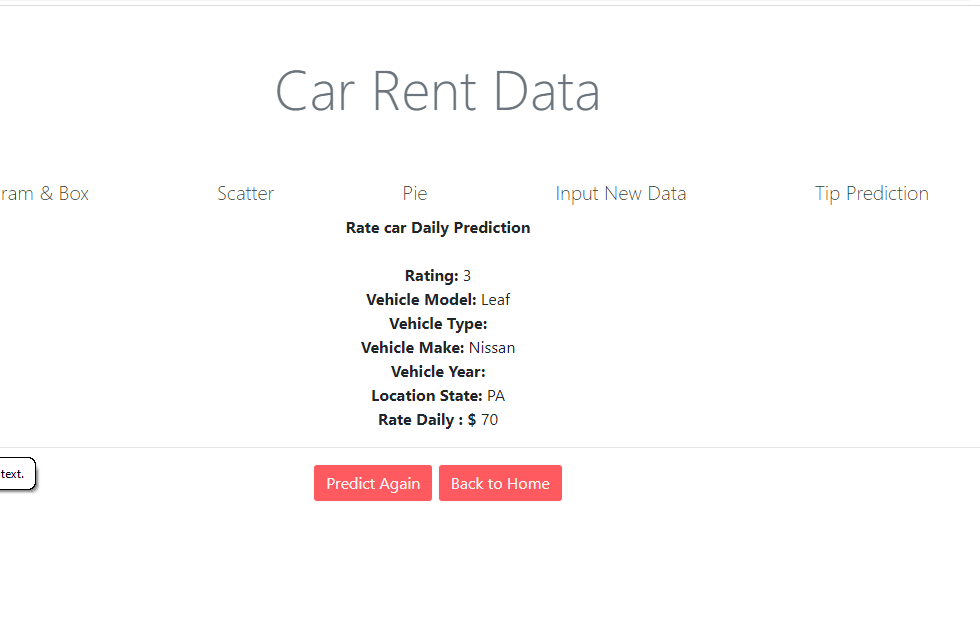

# Final-Project-Purwadhika-Data-Sains
Final Project Purwadhika Data Sains
# Project Akhir Job Connector Data Science "Electric Car Rent Rate Daily Prediction"
by Rafdy Harry

1. Problem
In this final project, I bring problems in the automotive field.
Many people want to rent cars, for various reasons.
But the problem is they are afraid if the rate daily price of electric cars is not in line with expectations.

2. Solution

The solution, in this final project I want to make these electric car rent more confident to rent the cars by offering an application that can predict the rate daily price of electric cars with features that I will explain later in the presentation.
# 1. Dataset and Data Cleaning

Feature in dataset:
 1   rating              : Rating vehicle
 2   renterTripsTaken    : Renter Trips Taken  
 3   reviewCount         : Review Count  
 4   location.city       : City Location 
 5   location.country    : Country Location 
 6   location.latitude   : Location Latitude
 7   location.longitude  : Location Longitude
 8   location.state      : Location State 
 9   owner.id            : Onwer ID  
 10  rate.daily          : Rate Daily  
 11  vehicle.make        : Vehicle Make 
 12  vehicle.model       : Vehicle Model 
 13  vehicle.type        : Vehicle Type 
 14  vehicle.year        : Vehicle Year
 
 we can see the df.info() and null values in dataframe:

1. dataframe info:

<class 'pandas.core.frame.DataFrame'>
RangeIndex: 5851 entries, 0 to 5850
Data columns (total 15 columns):
 #   Column              Non-Null Count  Dtype  
---  ------              --------------  -----  
 0   fuelType            5776 non-null   object 
 1   rating              5350 non-null   float64
 2   renterTripsTaken    5851 non-null   int64  
 3   reviewCount         5851 non-null   int64  
 4   location.city       5851 non-null   object 
 5   location.country    5851 non-null   object 
 6   location.latitude   5851 non-null   float64
 7   location.longitude  5851 non-null   float64
 8   location.state      5851 non-null   object 
 9   owner.id            5851 non-null   int64  
 10  rate.daily          5851 non-null   int64  
 11  vehicle.make        5851 non-null   object 
 12  vehicle.model       5851 non-null   object 
 13  vehicle.type        5851 non-null   object 
 14  vehicle.year        5851 non-null   int64  
dtypes: float64(3), int64(5), object(7)
memory usage: 685.8+ KB

2. na values:

After that i drop all na data

# make new data frame for Electri vehicle

Data Preprocessing
Drop data not applicable
use:
  dfb.drop(columns=['renterTripsTaken','reviewCount','location.city','location.country','location.latitude','location.longitude'], inplace=True)
One hot encoding

Splitting Data for modeling

# 3 Modeling
i was try Model Logistic Regression Base and Model KNN Base. we can see the comparison table of all models:
| Model                     |       LogReg       |        KNN          |
|---------------------------|--------------------|---------------------|
|Accuracy                   |0.035088            |0.02924              |

And i use KNN Base model is better model that i get

	
# 5. Dashboard
now i make a simple dashboard for deploying my machine learning.

1. Histogram & Box

2. Scatter

3. Pie

4. Input New Data

5. Predict

6. predict result

# 4 Conclusion

The conclusions drawn from my project are:

there are still a few electric cars in America that are rented right. the dominance of electric cars for rent is held by the Tesla brand. with the number 545 and the car model at most is Model 3 and the state that owns electric rental cars is located in the state of CA.

from the comparison of the two models used the Logistic Regression Base model and the KNN model. the KNN model has higher accuracy than the Logistic Regression Base and I decided to use the KNN model to use it as a model on my dashboard
